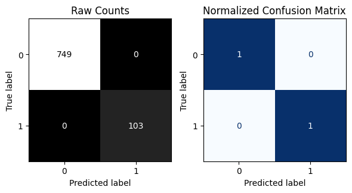
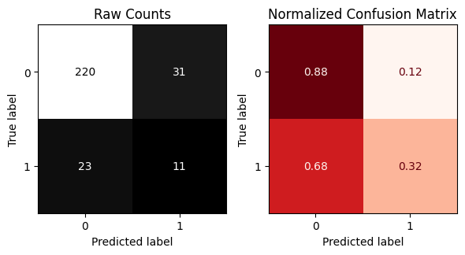

# Stroke Classification-Metrics
## **Stroke Prediction Classifier**
This project explores classification modeling for predicting whether a patient will experience a stroke (1) or not (0) based on medical and demographic features. The dataset is imbalanced (most patients do not have strokes), which introduces challenges in evaluation.

## **Project Objectives**

1. Preprocess the dataset using a ColumnTransformer with appropriate transformations for numerical and categorical variables.

2. Build and train a Decision Tree Classifier within a scikit-learn pipeline (with random_state=42 for reproducibility).

3. Evaluate model performance using accuracy, precision, recall, F1-score, and confusion matrices.

4. Interpret results with a focus on the medical context, especially false positives and false negatives.

## **Workflow**
1. Data Exploration

    * Checked class balance with value_counts().

    * Identified that strokes (1) are minority cases.

2. Preprocessing

    * Built a ColumnTransformer to:

      * Scale numeric features

      * One-hot encode categorical features

    * Applied preprocessing consistently to train and test sets.

3. Model

    * Default Decision Tree Classifier with random_state=13.

    * Trained the model inside a pipeline to ensure preprocessing + modeling consistency.

4. Evaluation

Custom functions were used to display:

  * Classification Report (precision, recall, F1, support)

   * Confusion Matrices (raw counts and normalized)

## **Results**
Training Performance
* Accuracy: 100% (overfit).

Test Performance
* Accuracy: 81%
* Precision (stroke class = 1): 0.26
* Recall (stroke class = 1): 0.32
* F1-score (stroke class = 1): 0.29

## **Interpretation**

1. **Overall accuracy** = 81%, but this is misleading due to class imbalance.

2. **False positives:** ~74% of stroke alerts are unnecessary (patients flagged but did not have a stroke).

3. **False negatives:** ~68% of actual strokes were missed by the model.

4. **Important metric to optimize**: Recall for stroke cases.

  * Missing a real stroke (false negative) can have severe health consequences.

  * False positives, while inconvenient, are less costly in this medical context.

## **Results Visualization**
Training Data Set Confusion Matrix

Testing Data Set Confusion Matrix

## **Key Takeaway**

This project highlights how accuracy can be misleading with imbalanced datasets. For medical applications like stroke detection, recall for the positive class is the most critical metric to optimize.
